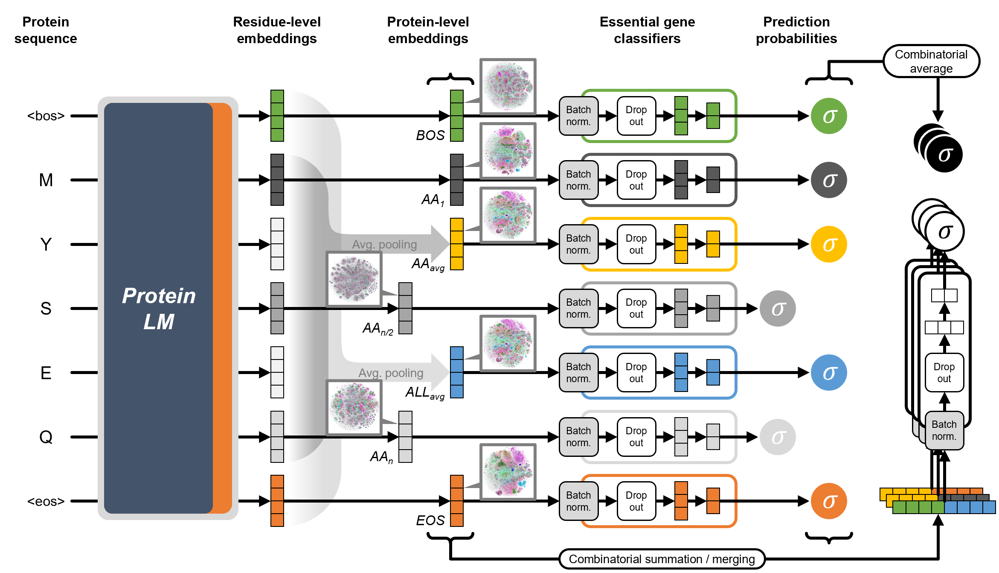

# Global Representations in Overlooked Single-tokens of pLMs

## Introduction
Recent advances in protein language models (pLMs) have opened new possibilities for computational biology. Traditionally, special tokens such as BOS (Beginning of Sequence) and EOS (End of Sequence) have been discarded when extracting protein-level embeddings. However, our study reveals that these overlooked single-token embeddings can inherently capture strong global information about proteins—sometimes outperforming the conventional average-pooling strategies.
This repository provides implementation to reproduce the test environments for each model introduced in the paper, *"Global Representations in Overlooked Single-token Embeddings of pLMs for Essential Gene Prediction"*, demonstrating the surprising predictive power of single-token embeddings in bacterial essential gene prediction tasks.
We aim to present a computationally efficient and easy-to-adopt alternative to existing methods, unlocking the full potential of pLM embeddings with minimal overhead.


## Key Features
- **Comprehensive Embedding Extraction:** Supports various protein-level embeddings from four state-of-the-art pLMs (ESM-3, ESM-2, ProtBERT, ProtT5), including average pooling and single-token extraction.
- **Flexible Ensemble Strategies:** Implement embedding summation, merging, and individual classifier confidence averaging to boost prediction accuracy.
- **Extended Bacterial Essential Gene Dataset**: Experimental essentiality data (features: *'essentiality', 'protein_seq', 'dna_seq', 'genome_id', 'locus_tag', etc.*) of over *280,000 bacterial genes* collected from 79 studies.

## Repository Structure
- **`data/raw_data/`**: Essential gene datasets (include non-essential genes) of each strain.
- **`data/exam_data/`**: Example test datasets consisting of genes from *E. coli* Keio collection.
- **`model/`**: Essential gene prediction models by ensemble combination.
- **`result/`**: Model evaluation, prediction results and model training history.
- **`source/`**: Jupyter notebook codes for sequence embedding or model test, etc.

## How to Use
1. **Clone the repository**:
   ```bash
   git clone https://github.com/sblabkribb/onetok-essprot.git
   cd onetok-essprot
   ```
2. **Install dependencies**:
   ```bash
   pip install -r requirements.txt
   ```
3. **Set options (data_path, etc.) in each source code**:
   ```python
   # set options (example of 'test-classifiers.ipynb')
   data_path = '../data/exam_data'
   model_path = '../model'
   result_path = '../result'
   set_ver = 'ts'  # dataset type: all, tr, ts
   ```
4. **Run the source code**:
   - **Test example:** embed-pLLMs.ipynb > test-classifiers.ipynb
   - **Model training:** data-build_set.ipynb > embed-pLLMs.ipynb > train-classifiers.ipynb
   - Please be careful with `data_path` and `set_ver` settings


## Citation
To cite this work, please reference:
```
Seongbo Heo et al. "Global Representations in Overlooked Single-token Embeddings of pLMs for Essential Gene Prediction" Synthetic Biology Research Center, KRIBB.
```

## Acknowledgments
This project was supported by the **Korea Research Institute of Bioscience and Biotechnology (KRIBB)** and the **National Research Foundation of Korea**.